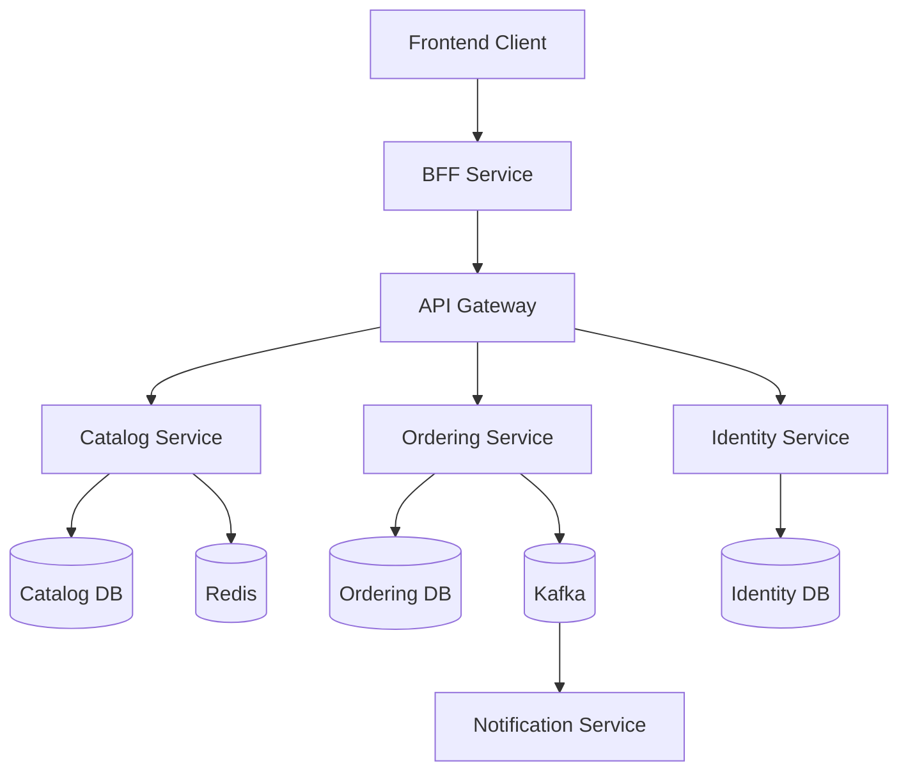

# EcommerceMicroservices
A practical enterprise backend training project built with **.NET 10**, **ASP.NET Core**, **Clean Architecture**, **CQRS**, **Kafka**, **Docker**, **Redis**, **SQL Server**, **Event-Driven Architecture**, **Event Sourcing**, and **Kubernetes**.

The main goal of this repository is not only to build an e-commerce system.

The goal is to understand how professional backend systems are designed when they need to be:

* Maintainable
* Scalable
* Secure
* Observable
* Testable
* Resilient
* Distributed
* Production-ready

This project follows a **rapid training approach**.

Instead of implementing every pattern in every service, each important concept is implemented first in **one representative service, endpoint, or business flow**.

For example:

* CQRS → one command and one query
* Redis → one product query
* Rate Limiting → one authentication endpoint
* Kafka → one `OrderCreated` event
* Outbox Pattern → one order flow
* Idempotency → one Kafka consumer
* Event Sourcing → one representative aggregate
* Separate CQRS databases → one representative read/write flow
* Kubernetes → deploy the main services and infrastructure

This keeps the project realistic without creating unnecessary repetition.

---

# Architecture Goals

The project will practice the following architectural styles and enterprise concepts:

* Microservices Architecture
* Clean Architecture
* Event-Driven Architecture
* Backend for Frontend — BFF
* API Gateway
* CQRS
* CQRS with separate physical read/write databases
* Event Sourcing
* Domain-Driven Design concepts
* Repository Pattern
* Unit of Work Pattern
* Mediator Pattern
* Result Pattern
* Outbox Pattern
* Idempotent Consumers
* Retry Strategies
* Eventual Consistency
* Distributed Caching
* Resilience Patterns
* Structured Logging
* Distributed Tracing
* Containerization
* Kubernetes orchestration

---

# Technology Stack

## Backend

* .NET 10
* C#
* ASP.NET Core Web API
* ASP.NET Core Worker Services
* Entity Framework Core
* MediatR
* FluentValidation
* AutoMapper where useful

## Databases

* SQL Server
* Separate database per microservice
* Separate physical read/write databases for one CQRS implementation

## Messaging

* Apache Kafka
* Kafka Topics
* Producers
* Consumers
* Consumer Groups
* Integration Events
* Dead Letter Topics
* Retry Strategies

## Cache

* Redis

## Security

* JWT Authentication
* Refresh Tokens
* Roles
* Policy-Based Authorization
* Rate Limiting
* Secure configuration
* Environment Variables
* User Secrets

## Observability

* Serilog
* Structured Logging
* Correlation IDs
* OpenTelemetry
* Distributed Tracing
* Health Checks

## Infrastructure

* Docker
* Docker Compose
* Kubernetes
* API Gateway
* BFF

## Testing

* xUnit
* Moq or NSubstitute
* ASP.NET Core Integration Testing
* TestContainers where useful
* Kafka integration testing where useful

---

# Microservices

The system contains the following main services.

## 1. Catalog Service

Responsible for:

* Products
* Categories
* Product queries
* Product management

Main technologies and patterns:

* Clean Architecture
* Entity Framework Core
* SQL Server
* CQRS
* MediatR
* Redis
* FluentValidation
* Result Pattern

Example endpoints:

```http
GET /api/products
GET /api/products/{id}
POST /api/products
PUT /api/products/{id}
DELETE /api/products/{id}
```

Redis will initially be applied only to:

```http
GET /api/products/{id}
```

---

## 2. Ordering Service

Responsible for:

* Orders
* Order Items
* Order Status
* Order business rules
* Outbox Messages

This will be one of the most important services in the project.

Main patterns:

* Clean Architecture
* CQRS
* MediatR
* Repository Pattern
* Unit of Work
* Domain Events
* Integration Events
* Outbox Pattern
* Event-Driven Architecture
* Event Sourcing
* Eventual Consistency

Main representative endpoint:

```http
POST /api/orders
```

The main flow will become:

```text
Client
  │
  ▼
Ordering API
  │
  ▼
CreateOrderCommand
  │
  ▼
CreateOrderHandler
  │
  ▼
Order Aggregate
  │
  ├── Save Order
  └── Save Outbox Message
        │
        ▼
     SQL Server
        │
        ▼
Outbox Background Worker
        │
        ▼
      Kafka
        │
        ▼
Notification Service
```

---

## 3. Identity Service

Responsible for:

* Users
* Password hashing
* Authentication
* JWT Access Tokens
* Refresh Tokens
* Roles
* Policies

Representative endpoints:

```http
POST /api/auth/login
POST /api/auth/refresh
```

Security concepts:

* JWT
* Refresh Tokens
* Password Hashing
* Role-Based Authorization
* Policy-Based Authorization
* Rate Limiting

Rate limiting will first be applied only to:

```http
POST /api/auth/login
```

---

## 4. Notification Service

Responsible for consuming integration events.

Initial event:

```text
OrderCreated
```

Flow:

```text
Kafka
  │
  ▼
Notification Consumer
  │
  ├── Validate Event
  ├── Check Idempotency
  ├── Execute Retry Strategy
  └── Simulate Notification
```

The service will initially simulate:

* Email notifications
* Push notifications

It will also demonstrate:

* Kafka Consumers
* Retry
* Dead Letter Topics
* Idempotency
* Consumer Error Handling

---

## 5. API Gateway

The API Gateway will act as a central entry point.

Possible responsibilities:

* Routing
* Authentication forwarding
* Headers
* Rate limiting
* Request forwarding

Architecture:

```text
Client
  │
  ▼
API Gateway
  │
  ├── Catalog Service
  ├── Ordering Service
  └── Identity Service
```

YARP can be used as the reverse proxy implementation.

---

## 6. BFF — Backend for Frontend

The BFF provides APIs designed specifically for frontend needs.

It is different from the API Gateway.

The Gateway mainly routes requests.

The BFF can combine information from multiple services.

Example:

```http
GET /api/home
```

The BFF could internally call:

```text
Catalog Service
+
Ordering Service
```

and return:

```json
{
  "featuredProducts": [],
  "recentOrders": []
}
```

This teaches:

* API Composition
* HttpClient
* Service-to-service communication
* Resilience
* Frontend-specific DTOs

---

# High-Level Architecture



---

# Database-per-Service

Each microservice owns its own database.

```text
Catalog Service
      │
      ▼
CatalogDb


Ordering Service
      │
      ▼
OrderingDb


Identity Service
      │
      ▼
IdentityDb
```

A service must not directly query another service's database.

For example, Ordering should not execute:

```sql
SELECT *
FROM IdentityDb.Users
```

Instead, services communicate through:

* HTTP
* Kafka Events
* Local replicated data when appropriate

This creates clear service boundaries.

---

# CQRS

CQRS means:

> Command Query Responsibility Segregation.

It separates operations that change data from operations that read data.

```text
Command
   │
   ▼
Change System State


Query
   │
   ▼
Read Information
```

Representative implementations:

```text
CreateOrderCommand
CreateOrderCommandHandler
```

and:

```text
GetProductByIdQuery
GetProductByIdQueryHandler
```

MediatR will be used to dispatch commands and queries.

---

# CQRS with Separate Physical Read/Write Databases

Later in the project, CQRS will be taken one step further.

Instead of commands and queries using the same database:

```text
Commands ─┐
          ├── Database
Queries ──┘
```

we will practice:

```text
Commands
   │
   ▼
Write Database
   │
   ▼
Events
   │
   ▼
Read Projection
   │
   ▼
Read Database
   ▲
   │
Queries
```

Architecture:

```text
POST /orders
     │
     ▼
Command Handler
     │
     ▼
OrderingWriteDb
     │
     ▼
Domain / Integration Event
     │
     ▼
Projection Handler
     │
     ▼
OrderingReadDb
```

Then queries use:

```text
GET /orders
     │
     ▼
OrderingReadDb
```

This concept will be implemented only for one representative flow.

The purpose is to understand why large distributed systems may optimize writes and reads independently.

---

# Event-Driven Architecture

The system uses Kafka for asynchronous communication.

Example:

```text
Ordering Service
       │
       │ OrderCreated
       ▼
     Kafka
       │
       ▼
Notification Service
```

The producer does not need to wait for the Notification Service.

This reduces direct coupling between services.

---

# Integration Events

Our first integration event will be:

```text
OrderCreated
```

Conceptual contract:

```text
EventId
OrderId
UserId
Total
CreatedAt
CorrelationId
```

Integration events should contain only the information required by other services.

Database entities should not be sent directly through Kafka.

---

# Domain Events vs Integration Events

A Domain Event describes something important that happened inside one business domain.

Example:

```text
OrderCreatedDomainEvent
```

An Integration Event communicates something to another microservice.

Example:

```text
OrderCreatedIntegrationEvent
```

Possible flow:

```text
Order Aggregate
      │
      ▼
Domain Event
      │
      ▼
Application Layer
      │
      ▼
Outbox Message
      │
      ▼
Integration Event
      │
      ▼
Kafka
```

---

# Outbox Pattern

Publishing directly to Kafka after saving an order can create consistency problems.

Problem:

```text
Save Order
    │
    ▼
Database Success
    │
    ▼
Publish Kafka Event
    │
    X
Kafka Failure
```

The order exists, but the event was lost.

The Outbox Pattern solves this by saving both pieces of information in one transaction.

```text
Database Transaction
      │
      ├── Save Order
      └── Save OutboxMessage
      │
      ▼
Commit
```

A background worker later publishes the pending events:

```text
Outbox
   │
   ▼
Background Worker
   │
   ▼
Kafka
```

---

# Background Workers

The Ordering Service will include an Outbox Publisher.

It will:

```text
Read Pending Messages
        │
        ▼
Publish To Kafka
        │
        ▼
Mark Message As Processed
```

This introduces the .NET:

```csharp
BackgroundService
```

concept.

---

# Idempotency

Kafka can deliver the same message more than once.

Example:

```text
OrderCreated #100
OrderCreated #100
```

The Notification Service should not send the same notification twice.

We will use a processed message mechanism:

```text
Message Received
      │
      ▼
EventId Already Processed?
      │
  ┌───┴───┐
 Yes      No
  │        │
Ignore   Process
```

---

# Retry Strategy

Temporary errors can happen.

Example:

```text
Kafka Event
    │
    ▼
Notification Service
    │
    X
Temporary Failure
```

We can retry:

```text
Attempt 1
Attempt 2
Attempt 3
```

If all attempts fail, the message can move to a Dead Letter Topic.

---

# Dead Letter Topic

Example:

```text
orders.created
      │
      ▼
Consumer
      │
      X
Retries Exhausted
      │
      ▼
orders.created.dlq
```

This allows failed messages to be inspected and processed later.

---

# Event Sourcing

Event Sourcing stores changes as a sequence of events instead of only storing the latest state.

Traditional model:

```text
Order
Status = Shipped
```

With Event Sourcing:

```text
OrderCreated
     │
     ▼
OrderConfirmed
     │
     ▼
OrderPaid
     │
     ▼
OrderShipped
```

The current state can be rebuilt by replaying those events.

Example:

```text
OrderCreated
+
OrderPaid
+
OrderShipped
=
Current Order State
```

For training, Event Sourcing will be applied to only **one representative Order aggregate**.

We will learn:

* Event Store
* Aggregate reconstruction
* Event stream
* Event version
* Append-only events
* Event replay
* Projections
* Event Sourcing vs normal CRUD
* Event Sourcing vs Integration Events

We will not convert the complete application to Event Sourcing.

---

# Eventual Consistency

In distributed systems, every service does not always update at exactly the same time.

Example:

```text
Ordering Service:
Order Created
```

but:

```text
Notification Service:
Event not processed yet
```

A short time later:

```text
Notification Service:
Notification Sent
```

The system eventually reaches a consistent state.

This is called:

> Eventual Consistency.

Kafka, Event Sourcing, Outbox, and physical CQRS databases make this concept easier to understand.

---

# Redis

Redis will be used as a distributed cache.

Representative endpoint:

```http
GET /api/products/{id}
```

Flow:

```text
Request
   │
   ▼
Redis
   │
   ├── Cache Hit
   │      │
   │      ▼
   │    Return
   │
   └── Cache Miss
          │
          ▼
      SQL Server
          │
          ▼
      Store Redis
          │
          ▼
        Return
```

We will also study cache invalidation.

---

# BFF Resilience

The BFF depends on other services.

Example:

```text
BFF
 │
 ▼
Catalog Service
```

Distributed systems can fail temporarily.

We will apply resilience to one HttpClient.

Concepts:

* Timeout
* Retry
* Circuit Breaker

Example:

```text
BFF
 │
 ▼
Catalog failing repeatedly
 │
 ▼
Circuit Breaker Opens
 │
 ▼
Stop requests temporarily
```

---

# Correlation IDs

A Correlation ID allows us to follow one request across multiple services.

Example:

```text
CorrelationId = 83c1741...
```

The same identifier can travel through:

```text
Gateway
   │
   ▼
BFF
   │
   ▼
Ordering
   │
   ▼
Kafka
   │
   ▼
Notification
```

Logs can then be searched using the same Correlation ID.

---

# Structured Logging

Instead of only logging text:

```text
Order created
```

logs should contain structured information.

Example:

```text
Event = OrderCreated
OrderId = 100
UserId = 20
CorrelationId = abc123
```

Sensitive information must never be logged.

Do not log:

* Passwords
* JWT Access Tokens
* Refresh Tokens
* Database passwords
* Secret keys

---

# Distributed Tracing

OpenTelemetry will be introduced to understand request traces.

Conceptual trace:

```text
Create Order Trace
│
├── API Gateway
├── Ordering API
├── Command Handler
├── SQL Server
├── Kafka Producer
└── Notification Consumer
```

This helps identify:

* Slow requests
* Failing dependencies
* Service relationships
* Distributed errors

---

# Authentication

The Identity Service will generate:

```text
Access Token
+
Refresh Token
```

Flow:

```text
User
  │
  ▼
POST /auth/login
  │
  ▼
Identity Service
  │
  ├── Validate Credentials
  ├── Generate JWT
  └── Generate Refresh Token
```

---

# Authorization

We will practice both roles and policies.

Example role:

```text
Admin
```

Representative protected endpoint:

```http
POST /api/products
```

Policy example:

```text
CanManageCatalog
```

---

# Rate Limiting

Rate limiting will first be applied only to:

```http
POST /api/auth/login
```

This helps reduce:

* Brute-force attacks
* API abuse
* Excessive traffic

---

# Health Checks

Services will expose health endpoints.

Example:

```http
/health
```

Later we can separate:

```http
/health/live
/health/ready
```

Liveness answers:

> Is the application running?

Readiness answers:

> Is the application ready to process requests?

---

# Docker

Docker will be used to create reproducible environments.

Local infrastructure will include:

```text
Docker Compose
│
├── SQL Server
├── Kafka
├── Kafka UI
├── Redis
└── Services
```

During early development, infrastructure can run in Docker while APIs run directly from the IDE or .NET CLI.

Later the complete system can run using containers.

---

# Docker Networking

Containers communicate using service names.

Instead of:

```text
localhost:9092
```

a service inside Docker may use:

```text
kafka:9092
```

Example:

```text
catalog-api
ordering-api
identity-api
notification-service
redis
kafka
sqlserver
```

Docker provides DNS resolution between services inside the same network.

---

# Kubernetes

After the Docker version is stable, we will deploy a small representative version using Kubernetes.

The goal is not to create a complex Kubernetes platform.

We will learn the important building blocks.

Topics:

* Pods
* Deployments
* Services
* ConfigMaps
* Secrets
* Environment Variables
* Health Probes
* Replica Scaling
* Rolling Updates
* Resource Requests
* Resource Limits

Example:

```text
Kubernetes Cluster
│
├── Catalog Deployment
│     └── Catalog Pods
│
├── Ordering Deployment
│     └── Ordering Pods
│
├── Notification Deployment
│
├── Gateway Deployment
│
└── Services
```

Representative configuration:

```text
Deployment
   │
   ▼
2 Catalog Pods
   │
   ▼
Kubernetes Service
   │
   ▼
Traffic Distribution
```

We will deploy only the required services to understand Kubernetes instead of creating a large production cluster.

---

# Configuration

Different environments will use different configurations.

Examples:

```text
Development
Testing
Production
```

Configuration sources:

* appsettings.json
* appsettings.Development.json
* Environment Variables
* User Secrets
* Docker Compose variables
* Kubernetes ConfigMaps
* Kubernetes Secrets

Secrets must not be committed to Git.

---

# Clean Architecture

Where appropriate, a service will contain:

```text
Service
│
├── Domain
├── Application
├── Infrastructure
└── API
```

Example:

```text
Catalog
│
├── Ecommerce.Catalog.Domain
├── Ecommerce.Catalog.Application
├── Ecommerce.Catalog.Infrastructure
└── Ecommerce.Catalog.Api
```

Responsibilities:

## Domain

Contains:

* Entities
* Value Objects
* Domain Events
* Business Rules

It should not depend on infrastructure.

## Application

Contains:

* Commands
* Queries
* Handlers
* DTOs
* Validators
* Interfaces
* Application business flows

## Infrastructure

Contains:

* Entity Framework Core
* Repositories
* Database configuration
* Kafka Producers
* Redis
* External services

## API

Contains:

* Controllers or endpoints
* Middleware
* Authentication configuration
* Dependency Injection configuration
* Swagger
* HTTP concerns

---

# Proposed Repository Structure

```text
EcommerceMicroservices/
│
├── src/
│   │
│   ├── Services/
│   │   │
│   │   ├── Catalog/
│   │   │   ├── Ecommerce.Catalog.Api/
│   │   │   ├── Ecommerce.Catalog.Application/
│   │   │   ├── Ecommerce.Catalog.Domain/
│   │   │   └── Ecommerce.Catalog.Infrastructure/
│   │   │
│   │   ├── Ordering/
│   │   │   ├── Ecommerce.Ordering.Api/
│   │   │   ├── Ecommerce.Ordering.Application/
│   │   │   ├── Ecommerce.Ordering.Domain/
│   │   │   └── Ecommerce.Ordering.Infrastructure/
│   │   │
│   │   ├── Identity/
│   │   │   ├── Ecommerce.Identity.Api/
│   │   │   ├── Ecommerce.Identity.Application/
│   │   │   ├── Ecommerce.Identity.Domain/
│   │   │   └── Ecommerce.Identity.Infrastructure/
│   │   │
│   │   └── Notification/
│   │       ├── Ecommerce.Notification.Worker/
│   │       ├── Ecommerce.Notification.Application/
│   │       └── Ecommerce.Notification.Infrastructure/
│   │
│   ├── Gateway/
│   │   └── Ecommerce.Gateway/
│   │
│   ├── Bff/
│   │   └── Ecommerce.WebBff/
│   │
│   └── BuildingBlocks/
│       └── Ecommerce.IntegrationEvents/
│
├── tests/
│   │
│   ├── Catalog/
│   ├── Ordering/
│   └── Integration/
│
├── deploy/
│   │
│   ├── docker/
│   │   └── docker-compose.yml
│   │
│   └── kubernetes/
│       ├── catalog/
│       ├── ordering/
│       ├── identity/
│       ├── notification/
│       └── gateway/
│
├── docs/
│   ├── architecture/
│   ├── events/
│   └── diagrams/
│
├── AGENTS.md
├── README.md
└── EcommerceMicroservices.sln
```

The real structure may evolve during the training.

We will create only the folders and projects required by the current step.

---

# Shared Building Blocks

Shared code must be used carefully in microservices.

We do not want to create one large shared library containing business logic from all services.

Initially, shared code will be limited to contracts such as:

```text
Ecommerce.IntegrationEvents
```

Example:

```text
OrderCreatedIntegrationEvent
```

Business domain models remain inside their own services.

---

# Testing Strategy

The project follows the same rapid training philosophy for tests.

We will initially create:

## Unit Test

One handler:

```text
CreateOrderCommandHandler
```

## Integration Test

One representative API endpoint.

Example:

```http
POST /api/orders
```

## Kafka Integration Test

Later, one event flow:

```text
OrderCreated
```

## Event Sourcing Test

One aggregate reconstruction test.

Example:

```text
OrderCreated
+
OrderPaid
+
OrderShipped
→
Order State
```

We do not need hundreds of tests to learn the concepts.

---

# Main End-to-End Flow

The most important business flow is:

```text
Frontend
   │
   ▼
BFF
   │
   ▼
API Gateway
   │
   ▼
Ordering Service
   │
   ▼
CreateOrderCommand
   │
   ▼
Order Aggregate
   │
   ├── Order
   └── Domain Event
          │
          ▼
       Outbox
          │
          ▼
     OrderingDb
          │
          ▼
    Background Worker
          │
          ▼
        Kafka
          │
          ▼
 Notification Service
          │
          ├── Idempotency Check
          ├── Retry
          └── Send Notification
```

Across the complete flow we will eventually use:

```text
JWT
Correlation ID
Structured Logging
Distributed Tracing
Health Checks
```

---

# Security Principles

The project follows these security rules:

* Never store plain-text passwords
* Never log passwords
* Never log JWT tokens
* Never log refresh tokens
* Validate all external input
* Protect write endpoints
* Use JWT expiration
* Use refresh tokens carefully
* Use authorization policies
* Apply Rate Limiting where appropriate
* Keep secrets outside source control
* Use HTTPS in production
* Configure CORS carefully
* Avoid returning internal exception details
* Follow OWASP API security principles

---

# Learning Roadmap

## Phase 1 — Microservice Foundations

### Step 0

Define microservices domain and scope.

### Step 1

Create solution and folder structure.

### Step 2

Explain microservices architecture.

### Step 3

Create Catalog Service.

### Step 4

Add Clean Architecture to Catalog Service.

### Step 5

Create Catalog domain entities.

### Step 6

Configure Entity Framework Core for Catalog Service.

### Step 7

Implement basic Catalog CRUD.

---

# Phase 2 — Ordering

### Step 8

Create Ordering Service.

### Step 9

Create Ordering domain entities.

### Step 10

Implement Create Order flow.

---

# Phase 3 — Event-Driven Architecture

### Step 11

Explain Event-Driven Architecture.

### Step 12

Add Kafka using Docker Compose.

### Step 13

Create shared Integration Event contracts.

### Step 14

Publish `OrderCreated` directly to Kafka.

### Step 15

Create Notification Service.

### Step 16

Consume `OrderCreated`.

### Step 17

Add Retry Strategy.

### Step 18

Add Idempotency.

---

# Phase 4 — Reliable Messaging

### Step 19

Explain Outbox Pattern.

### Step 20

Implement Outbox table.

### Step 21

Add Outbox Background Worker.

### Step 22

Replace direct Kafka publishing with Outbox Pattern.

---

# Phase 5 — Observability

### Step 23

Add Correlation IDs.

### Step 24

Add Structured Logging.

### Step 25

Add Health Checks.

---

# Phase 6 — Edge Services and Security

### Step 26

Add API Gateway.

### Step 27

Create Identity Service and JWT authentication.

### Step 28

Protect one representative endpoint.

### Step 29

Add Redis to one representative use case.

### Step 30

Add Rate Limiting to one representative endpoint.

---

# Phase 7 — Testing and Refactoring

### Step 31

Add one Unit Test.

### Step 32

Add one Integration Test.

### Step 33

Review Clean Code and refactor.

---

# Phase 8 — Advanced Enterprise Architecture

### Step 34

Add BFF with one API Composition endpoint.

Topics:

* BFF Pattern
* HttpClient
* API Composition
* Resilience
* Timeout
* Retry
* Circuit Breaker

### Step 35

Implement Event Sourcing for one representative Order aggregate.

Topics:

* Event Store
* Event Streams
* Aggregate Reconstruction
* Event Replay
* Projections
* Event Versions

### Step 36

Implement CQRS with separate physical read/write databases.

Representative scope:

```text
OrderingWriteDb
+
OrderingReadDb
```

Topics:

* Write Model
* Read Model
* Projection
* Eventual Consistency
* Independent scaling

### Step 37

Add OpenTelemetry and basic Distributed Tracing.

Representative flow:

```text
Gateway
→ Ordering
→ Kafka
→ Notification
```

### Step 38

Containerize the complete representative system.

Topics:

* Dockerfiles
* Docker Compose
* Docker Networking
* Environment Configuration

### Step 39

Deploy a representative architecture with Kubernetes.

Topics:

* Pods
* Deployments
* Services
* ConfigMaps
* Secrets
* Health Probes
* Replica Scaling
* Rolling Updates
* Resource Limits

### Step 40

Production Readiness Review.

Review:

* Security
* Resilience
* Scalability
* Observability
* Data Ownership
* Event Contracts
* Configuration
* Secrets
* Database migrations
* Failure handling

### Step 41

Final Architecture Review and Learning Summary.

---

# Rapid Training Rule

Every new concept follows the same process:

```text
Understand the Problem
       │
       ▼
Understand the Pattern
       │
       ▼
Implement ONE Example
       │
       ▼
Test It
       │
       ▼
Review Production Considerations
       │
       ▼
Explain How To Expand It
       │
       ▼
Move Forward
```

This repository intentionally avoids implementing the same pattern repeatedly when the learning value would be low.

---

# Architecture Evolution

The project starts simple:

```text
Catalog API
     │
     ▼
CatalogDb
```

Then evolves to:

```text
Multiple Microservices
```

then:

```text
Microservices
+
Kafka
```

then:

```text
Microservices
+
Kafka
+
Outbox
```

then:

```text
Microservices
+
CQRS
+
Separate Databases
```

then:

```text
Microservices
+
Event Sourcing
```

and finally:

```text
Microservices
+
BFF
+
API Gateway
+
Kafka
+
Outbox
+
Event Sourcing
+
CQRS
+
Redis
+
Observability
+
Docker
+
Kubernetes
```

The purpose is to understand **why each architectural decision exists**, instead of starting with unnecessary complexity.

---

# Important Architecture Principle

This project does not use patterns only because they are considered "enterprise."

Every pattern should solve a real problem.

For example:

```text
Problem:
Frontend needs data from multiple services.

Solution:
BFF / API Composition.
```

```text
Problem:
Services need asynchronous communication.

Solution:
Kafka.
```

```text
Problem:
Database transaction succeeds but Kafka fails.

Solution:
Outbox Pattern.
```

```text
Problem:
Consumer processes the same event twice.

Solution:
Idempotency.
```

```text
Problem:
Read workload is very different from write workload.

Solution:
CQRS with separate read/write databases.
```

```text
Problem:
We need the complete history of an aggregate.

Solution:
Event Sourcing.
```

```text
Problem:
We need to deploy and scale containers reliably.

Solution:
Kubernetes.
```

Understanding the problem before using the pattern is one of the main goals of this repository.

---

# Current Status

Current phase:

```text
Step 0 — Domain and Scope
```

Completed:

* E-commerce domain selected
* Main services defined
* Enterprise concepts selected
* Rapid training strategy defined
* Architecture roadmap defined

Next:

```text
Step 1 — Create Solution and Folder Structure
```

---

# Main Learning Outcome

By the end of this project, the objective is to understand how a modern .NET distributed backend can combine:

```text
.NET 10
ASP.NET Core
Clean Architecture
Microservices
CQRS
Physical Read/Write Databases
Event-Driven Architecture
Kafka
Event Sourcing
Outbox Pattern
Idempotency
Redis
JWT
BFF
API Gateway
Resilience
Observability
Docker
Kubernetes
Testing
```

while understanding not only **how to implement each technology**, but more importantly:

> **why it exists, what problem it solves, when to use it, and when not to use it.**